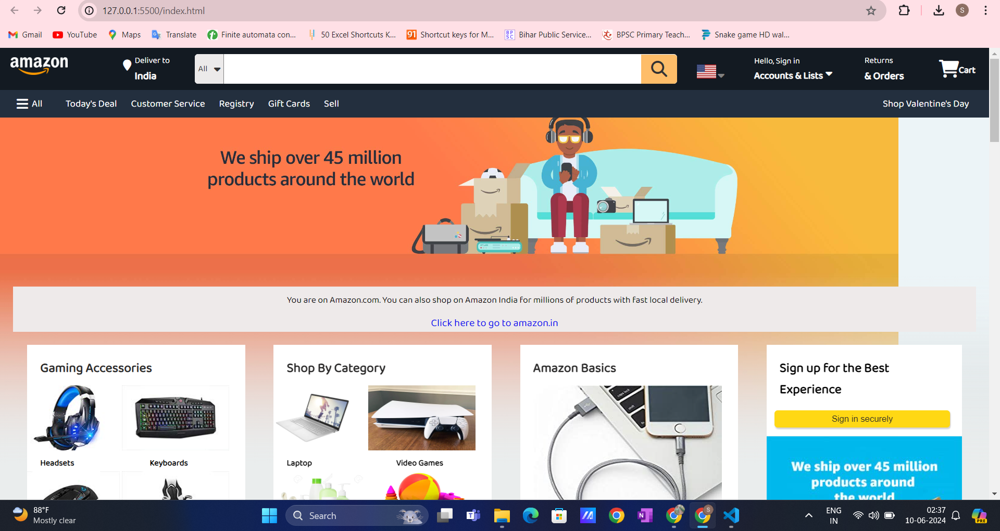
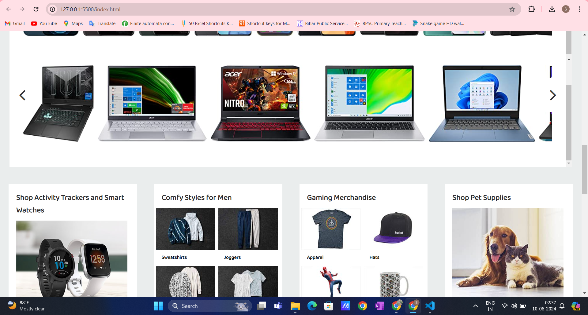
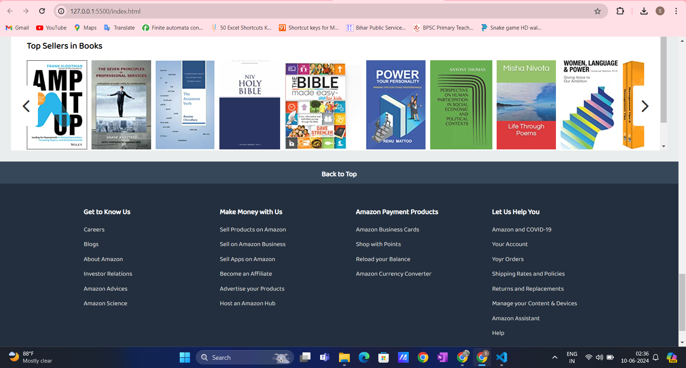

# Amazon Clone Project (HTML & CSS)



## Overview

This project is a simplified clone of Amazon's user interface, built using only HTML and CSS. It aims to replicate the main layout and styling of the Amazon website.

### Features

- **Main Page**: Landing page similar to Amazon, showcasing products.
- **Product Listing**: Grid layout displaying products with images, names, and prices.
- **Navigation Bar**: Header with Amazon logo, search bar, and navigation links.
- **Footer**: Footer section with links to various parts of the site.

## Technologies Used

- **HTML**: Structure and content of the web pages.
- **CSS**: Styling for layout, colors, fonts, and responsiveness.

## Getting Started

To view the project locally, simply download or clone the repository and open the `index.html` file in your web browser.

### Installation

1. Clone the repository:

   ```bash
   git clone https://github.com/yourusername/amazon-clone-html-css.git
   cd amazon-clone-html-css
   ```

2. Open `index.html` file in your preferred web browser.

## Screenshots





## Contributing

Contributions are welcome! Please fork the repository and submit a pull request.


## Acknowledgments

- This project is a learning exercise inspired by Amazon's website layout and design.
- Special thanks to online resources and tutorials that helped in learning HTML and CSS.
